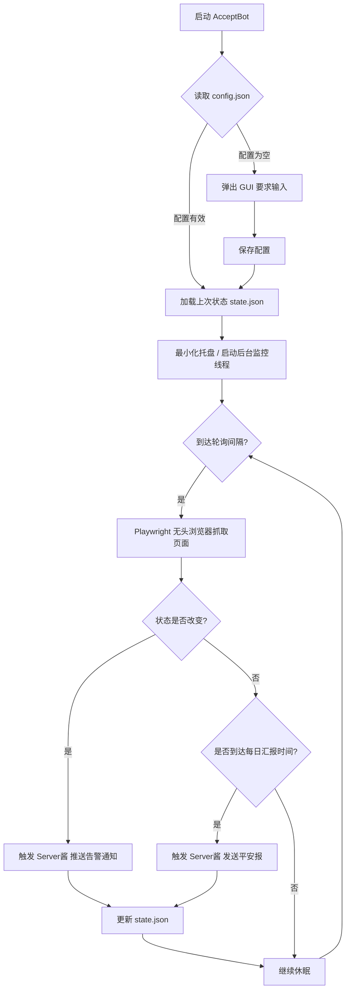

<div align="center">

# 🤖 AcceptBot
**学术期刊状态自动化监控助手 | Academic Submission Status Monitor**

[🇨🇳 简体中文](README.md) | [🇬🇧 English](README_en.md)

[](https://www.python.org/)
[](https://playwright.dev/python/)
[](https://doc.qt.io/qtforpython/)
[](https://opensource.org/licenses/MIT)

*告别刷页面的焦虑，让您的科研生活更从容。*

</div>

---

## 📖 关于项目 (About)

**AcceptBot** 是一款专为科研工作者打造的桌面级自动化监控工具。它能够代替人工，7x24 小时静默监控 Editorial Manager、ScholarOne 等主流学术期刊投稿系统的稿件状态。

当您的论文状态发生**任何实质性变化**（例如从 *Under Review* 变为 *Required Reviews Completed*），AcceptBot 会在第一时间通过微信推送通知您。此外，它还提供“每日平安报”功能，定时为您汇报当前状态，缓解等待过程中的焦虑感。

> **核心理念**：将重复的机械劳动交给程序，把宝贵的精力留给学术创新。

---

## ✨ 核心特性 (Features)

- 🖥️ **现代化图形交互 (GUI)**：基于 `PySide6` 打造，提供直观的配置面板，告别繁琐的命令行配置。
- 🕵️ **无感后台运行**：支持最小化至系统托盘 (System Tray)，完全不打扰您的日常桌面工作。
- 📲 **微信实时推送**：接入 `Server酱`，状态变更毫秒级响应，通知直达您的微信。
- 🕰️ **防焦虑定时报**：自定义每日汇报时间（如每晚 19:00），确保程序正常运行的定心丸。
- 📦 **开箱即用 (Portable)**：支持 `PyInstaller` 一键打包为 `.exe` 独立程序，无需 Python 环境，随时随地运行。
- 🛡️ **高容错与重试机制**：内置 Playwright 强大的异步抓取能力与网络异常重试逻辑，确保断网重连后平稳恢复。

---

## ⚙️ 运行逻辑 (Workflow)



---

## 🚀 快速开始 (Quick Start)

### 1. 环境准备 (Prerequisites)
请确保您的计算机上已安装 [Python 3.9+](https://www.python.org/downloads/)。

### 2. 克隆与安装 (Installation)
```bash
# 克隆仓库
git clone https://github.com/yourusername/AcceptBot.git
cd AcceptBot

# 建议使用虚拟环境 (可选)
python -m venv venv
source venv/bin/activate  # Windows: venv\Scripts\activate

# 安装核心依赖
pip install playwright requests PySide6 schedule pyinstaller

# 安装浏览器内核 (Playwright 必须)
playwright install chromium
```

### 3. 本地运行 (Run)
```bash
python main.py
```

### 4. 一键打包发布 (Build Executable)
如需将程序打包发送给没有 Python 环境的同行：
```bash
# Windows 环境下运行内置批处理脚本
build_portable_exe.bat
```
执行完毕后，可在 `dist/` 目录下找到 `AcceptBot.exe`，直接双击即可运行。

---

## 🕹️ 使用指南 (Usage)

1. **获取推送密钥**：前往 [Server酱](https://sct.ftqq.com/) 官网，微信扫码登录并免费获取一个 `SendKey`。
2. **配置程序**：
   - 双击打开 `AcceptBot.exe`。
   - 在主界面填入：**期刊登录网址 URL**、**账号 Username**、**密码 Password** 以及刚才获取的 **SendKey**。
   - 点击 **保存配置 (Save)**。
3. **开启监控**：点击 **启动监控 (Start)** 按钮，此时控制台将开始打印后台运行日志。
4. **后台守护**：点击窗口右上角的关闭 `X` 按钮，程序将自动隐藏到右下角**系统托盘**。您可以右键托盘图标呼出菜单，选择“显示主窗口”或“完全退出”。

---

## 📁 项目结构 (Project Structure)

```text
AcceptBot/
├── main.py                # 应用程序入口，初始化 GUI 和系统托盘
├── spider.py              # Playwright 网页自动化抓取与解析核心逻辑
├── data_manager.py        # 配置 (config) 与状态 (state) 的本地读写模块
├── notifier.py            # 微信推送模块 (基于 Server酱 API)
├── build_portable_exe.bat # PyInstaller 快速打包脚本
├── config.json            # (自动生成) 用户私密配置
└── state.json             # (自动生成) 缓存上一次爬取的状态记录
```

---

## 🤝 参与贡献 (Contributing)

发现 bug 或者有新的需求（如支持新的期刊系统、接入邮件推送等）？我们非常欢迎您提交 Issue 和 Pull Request！

1. Fork 本仓库
2. 创建您的特性分支 (`git checkout -b feature/AmazingFeature`)
3. 提交您的修改 (`git commit -m 'Add some AmazingFeature'`)
4. 推送到分支 (`git push origin feature/AmazingFeature`)
5. 开启一个 Pull Request

---

## 📜 开源协议 (License)

本项目基于 [MIT License](LICENSE) 协议开源。您可以自由地使用、修改和分发，但请保留原作者的版权声明。

---

## ⚠️ 免责声明 (Disclaimer)

1. **学术道德与服务器负载**：本工具仅用作学术交流与个人科研效率提升。请合理设置监控轮询间隔（建议 1-4 小时），切勿使用极高频率刷新，以免对目标期刊服务器造成恶意 DdoS 级别的负担。
2. **隐私安全**：本项目**完全开源**，所有账号、密码、密钥信息仅保存在您本地的 `config.json` 文件中，不会上传至任何第三方服务器。请妥善保管个人电脑设备安全。

<div align="center">
<i>Happy Research & May all your papers be accepted! 🎉</i>
</div>
