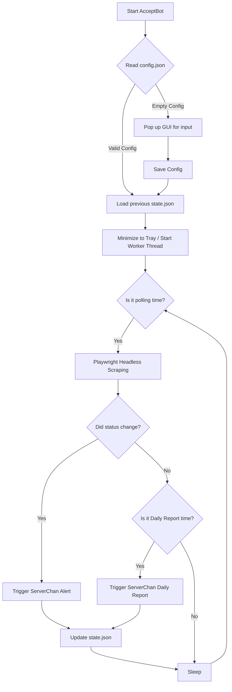

<div align="center">

# 🤖 AcceptBot
**Academic Submission Status Monitor**

[🇨🇳 简体中文](README.md) | [🇬🇧 English](README_en.md)

[](https://www.python.org/)
[](https://playwright.dev/python/)
[](https://doc.qt.io/qtforpython/)
[](https://opensource.org/licenses/MIT)

*Say goodbye to page-refreshing anxiety, and make your research life easier.*

</div>

---

## 📖 About

**AcceptBot** is a desktop automated monitoring tool designed specifically for researchers. It replaces manual checks by silently tracking your manuscript status on major academic submission systems (e.g., Editorial Manager, ScholarOne) 24/7.

Whenever there is a **substantive change** in your paper's status (e.g., from *Under Review* to *Required Reviews Completed*), AcceptBot will instantly notify you via WeChat. Additionally, it offers a "Daily Report" feature that sends a scheduled status summary to relieve your waiting anxiety.

> **Core Philosophy**: Leave repetitive mechanical tasks to programs, and save your precious energy for academic innovation.

---

## ✨ Features

- 🖥️ **Modern GUI**: Built with `PySide6`, providing an intuitive configuration panel—no complex command-line setups needed.
- 🕵️ **Silent Background Execution**: Can be minimized to the System Tray, running without interrupting your desktop workspace.
- 📲 **Real-time WeChat Push**: Integrated with `ServerChan`, delivering status changes to your WeChat in milliseconds.
- 🕰️ **Scheduled Daily Reports**: Customize a daily report time (e.g., 19:00 PM) to ensure the program is still guarding your paper.
- 📦 **Portable Executable**: Supports one-click packaging into a standalone `.exe` using `PyInstaller`. No Python environment required.
- 🛡️ **High Fault Tolerance**: Built-in retry mechanisms and Playwright's robust async scraping to gracefully handle network timeouts.

---

## ⚙️ Workflow



---

## 🚀 Quick Start

### 1. Prerequisites
Ensure you have [Python 3.9+](https://www.python.org/downloads/) installed.

### 2. Installation
```bash
# Clone the repository
git clone https://github.com/yourusername/AcceptBot.git
cd AcceptBot

# Optional: Create a virtual environment
python -m venv venv
source venv/bin/activate  # Windows: venv\Scripts\activate

# Install dependencies
pip install playwright requests PySide6 schedule pyinstaller

# Install browser binaries (Required for Playwright)
playwright install chromium
```

### 3. Run Locally
```bash
python main.py
```

### 4. Build Standalone Executable
If you want to share the app with colleagues who don't have Python installed:
```bash
# Run the built-in batch script (Windows)
build_portable_exe.bat
```
Once finished, you will find `AcceptBot.exe` in the `dist/` folder. Just double-click to run!

---

## 🕹️ Usage

1. **Get Push Key**: Go to [ServerChan](https://sct.ftqq.com/), log in via WeChat, and get a free `SendKey`.
2. **Configure App**:
   - Open `AcceptBot.exe`.
   - Enter your **Journal Login URL**, **Username**, **Password**, and the **SendKey**.
   - Click **Save**.
3. **Start Monitoring**: Click **Start**, and check the console logs to ensure it's running.
4. **Background Guard**: Close the window via the top-right `X`. The app will automatically hide into your **System Tray**. Right-click the tray icon to show the main window or exit completely.

---

## 📁 Project Structure

```text
AcceptBot/
├── main.py                # App entry point, GUI & System Tray initialization
├── spider.py              # Playwright scraping logic
├── data_manager.py        # Local I/O for config and state JSON files
├── notifier.py            # WeChat push module (ServerChan API)
├── build_portable_exe.bat # PyInstaller build script
├── config.json            # (Auto-generated) User private credentials
└── state.json             # (Auto-generated) Cached scraping state
```

---

## 🤝 Contributing

Found a bug or want to support a new journal system or email notifications? Issues and Pull Requests are highly welcome!

1. Fork the Project
2. Create your Feature Branch (`git checkout -b feature/AmazingFeature`)
3. Commit your Changes (`git commit -m 'Add some AmazingFeature'`)
4. Push to the Branch (`git push origin feature/AmazingFeature`)
5. Open a Pull Request

---

## 📜 License

Distributed under the [MIT License](LICENSE). See `LICENSE` for more information.

---

## ⚠️ Disclaimer

1. **Academic Ethics & Server Load**: This tool is strictly for personal efficiency. Please set a reasonable polling interval (e.g., 1-4 hours) to avoid overloading journal servers.
2. **Privacy & Security**: This is a fully open-source project. Your credentials are saved **locally** in `config.json` and are NEVER uploaded to any third-party server. Please keep your local environment secure.

<div align="center">
<i>Happy Research & May all your papers be accepted! 🎉</i>
</div>
